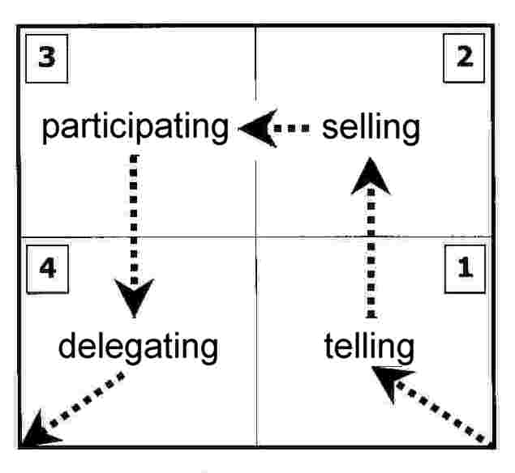

# Lecture 1: Module Introduction, Overview, and Team Formation

**Module:** MAN-10081 – Teams, People and Performance  
**Lecture Date:** 26 January 2026

---

## Introduction to the Module
The "Teams, People and Performance" (MAN-10081) module aims to provide an understanding of the principles and practices that underpin effective teamwork. It explores roles, dynamics, and leadership impacts on collective outcomes. The focus is on applying theories to real-world scenarios to develop collaborative skills necessary in diverse organizational settings.

The module is led by **Dr. Swati Garg** and supported by **Dr. Scott Bambrick**, Director of Keele Business School.

| | |
|---|---|
|  |  |
| *Dr. Swati Garg – Module Lead* | *Dr. Scott Bambrick – Director, Keele Business School* |

---

## Assessment Overview
Students are required to produce **either a 5–10-minute podcast or a 1500-word written report**. This is a deep reflection on experiences during team-based exercises, including collaborative tasks, leadership activities, and problem-solving challenges.

**Submission deadline: 11 May 2026, 1 pm, via KLE**

The submission must address three main areas:
* **Individual Role:** Your specific role, contributions, challenges faced, and lessons learned.
* **Team Dynamics:** How the group functioned, including communication methods, leadership styles, and strategies used.
* **Personal Development:** Skills gained and areas for future development in collaboration.

---

## What is a Team?
> *"A team is a small number of people with complementary skills who are committed to a common purpose, set of performance goals, and approach for which they hold themselves mutually accountable."*  
> — Katzenbach & Smith, *The Wisdom of Teams* (1993)

A **team** is essentially a **group + a GOAL + a PLAN** to reach it.

---

## Team Life Cycle Model (Tuckman & Jensen, 1977)
Teams generally pass through five stages of development:

| Stage | Description |
|---|---|
| **Forming** | Members are recruited or allocated, establishing initial contact |
| **Storming** | Working out positions; potential for conflict or personality clashes |
| **Norming** | Setting formal/informal rules, establishing roles and methods of working |
| **Performing** | Executing tasks with a focused, task-centred approach |
| **Adjourning / Mourning** | Project conclusion and team disbandment |

---

## Team Formation
When forming a team, consider:
- **Experience / ability / personality / work ethic** — balance these qualities
- Recruit expertise specific to the project (general or specialist)
- If skills are unavailable — buy in or develop them
- **Virtual teams** may involve in-house and external partners

Members can be:
- Recruited directly
- Allocated internally
- Drawn from existing staff
- Representatives from other organisations

---

## Team Processes & Charter
Teams benefit from a formal or informal **Team Charter** that sets out:
- Purpose of the team
- Roles and responsibilities
- Workload definitions
- Induction and socialisation processes (meetings, dress code, language norms)

Setting up:
- Allocate project roles and assign work (with standards and timescales)
- Setup support / training (formal, informal, courses, mentoring, computer-based)
- Establish feedback mechanisms (team meetings, reports, briefings, emails)

---

## Management Control & Leadership Style

### Situational Leadership Model (Hersey & Blanchard)

  
*The four management styles — Telling (S1), Selling (S2), Participating (S3), Delegating (S4) — adapt to follower readiness and task complexity.*

Management styles range from:
- **Prescriptive / Authoritarian** → heavily directed with specific rules
- **Self-directed / Collaborative** → autonomous teams with minimal supervision

Approaches include:
- **Direct supervision** — closely directing work
- **Mentoring** — supporting and guiding
- **Facilitation** — enabling the team to self-manage

---

## Dealing with Problematic Team Members
1. Obtain information and check/detect the problem
2. Decide on approach (formal or informal discussion)
3. Try to change their behaviour, monitor, and give feedback
4. Escalate to management if necessary (formal complaint)
5. Options: remove from team, change their work, reduce their involvement, or reduce project scope

---

## Belbin's Team Roles
Members have **dual roles**: their functional job role and their **team role**. Belbin identifies nine team roles based on four principal factors: *intelligence, dominance, extroversion, stability/anxiety*.

| Role | Strength | Allowable Weakness |
|---|---|---|
| **Plant** | Creative, imaginative, unorthodox; solves difficult problems | Ignores details; poor communicator |
| **Resource Investigator** | Extrovert, enthusiastic; explores opportunities | Over-optimistic; loses interest quickly |
| **Co-ordinator** | Mature, confident; clarifies goals, delegates well | Can appear manipulative |
| **Shaper** | Challenging, dynamic; thrives under pressure | Can provoke others; hurts feelings |
| **Monitor Evaluator** | Sober, strategic, discerning; judges accurately | Lacks drive to inspire; overly critical |
| **Team Worker** | Co-operative, perceptive, diplomatic; calms tensions | Indecisive under pressure |
| **Implementer** | Disciplined, reliable; turns ideas into practical actions | Inflexible; slow to adapt |
| **Completer / Finisher** | Conscientious; searches for errors; delivers on time | Worries excessively; reluctant to delegate |
| **Specialist** | Single-minded; provides rare knowledge and skills | Contributes on a narrow front only |

A well-functioning team requires a **mix of these roles**, balancing extroverts/introverts and creative/analytical thinkers.

---

## The Hidden Challenge of Every Team Task
> *"It always involves not one but TWO tasks: the task itself, PLUS the larger and more difficult task of looking after the team and keeping it together in order to achieve the task."*

Some suggest the split is **1/3 task : 2/3 team management**. As a student, you are used to doing tasks yourself — but managing the team dimension is a vital step toward becoming a professional manager.

---

## Practical Tips for Group Work
- Assign someone to **take notes** and distribute them after each meeting
- Set clear **ground rules** and regular meeting times
- Establish **individual targets** to maintain accountability
- Have a team charter/rules of engagement from the start
