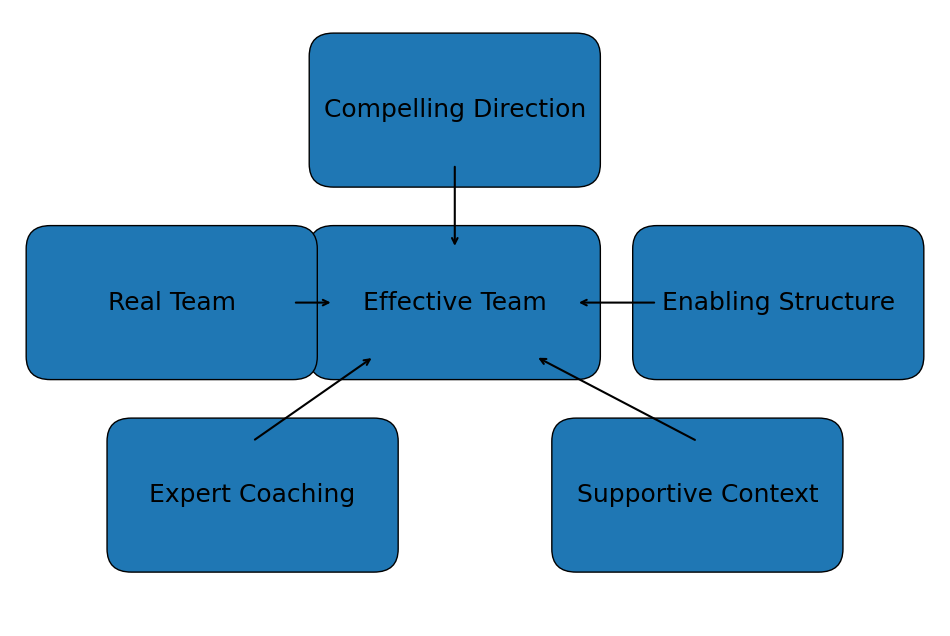
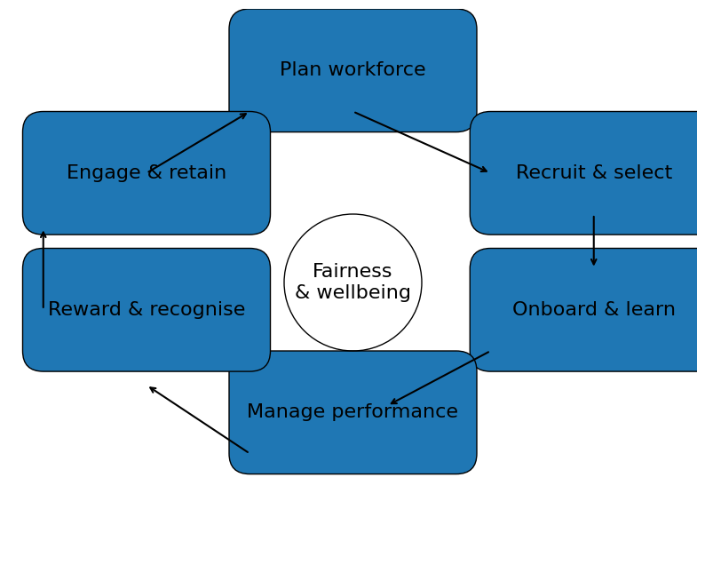

# Lecture 4: Teams, Leadership & Managing People

**Module:** MAN-10081 – Teams, People and Performance

---

## Core Distinctions: Groups vs. Teams

| | **Group** | **Team** |
|---|---|---|
| Coordination | Individuals coordinate (sometimes loosely) | Interdependence is designed-in |
| Accountability | Mainly individual | Mutual accountability and shared goals |
| Output | Aggregated (sum of parts) | Synergy possible (whole > sum of parts) |
| Roles | May share information and resources | Complementary roles; explicit coordination |
| Example | People in the same department | Product squad delivering a feature |

---

## Why Organisations Use Teams — and When They Backfire

Teams are **not automatically better** — they are a **design choice**.

**Potential Benefits:**
- Broader skill mix → better problem solving
- Faster learning and knowledge sharing
- More commitment when people co-create goals
- Improved coordination across functions
- Resilience: coverage when someone is absent

**Common Risks:**
- Coordination cost (meetings, handoffs)
- Social loafing / unclear accountability
- Groupthink: premature consensus
- Conflict escalation (task → relationship conflict)
- Inequity perceptions (effort vs. rewards)

---

## Common Team Types

| Team Type | Description | Typical Risk |
|---|---|---|
| **Functional / Operational** | Stable, within one function | Silos, local optimisation |
| **Cross-functional / Project** | Temporary or product-based | Role ambiguity, conflict |
| **Self-managed / Autonomous** | High discretion | Coordination with wider org |
| **Virtual / Distributed** | Across locations/time zones | Trust + communication gaps |
| **Leadership / Top Team** | Sets direction and allocates resources | Politics, groupthink |
| **Communities of Practice** | Learning & knowledge sharing | Low priority, weak sponsorship |

---

## Team Development: Tuckman's Stages (Diagnostic Lens)

> Use stages as a **map, not a rigid script** — teams can move back and forth.

| Stage | What's Happening | Leader's Role |
|---|---|---|
| **Forming** | Orientation, uncertainty | Establish purpose + roles |
| **Storming** | Conflict, testing norms | Facilitate + provide clarity |
| **Norming** | Shared rules & trust emerge | Support commitment + feedback |
| **Performing** | High interdependence | Provide autonomy + backing |
| **Adjourning** | Closure / transition | Review + celebrate learning |

---

## Hackman's Conditions for Team Effectiveness

  
*Hackman's model: five conditions that leaders must set for teams to perform — compelling direction, real team structure, enabling structure, expert coaching, and supportive context.*

> **Key insight:** Team performance depends heavily on the **conditions leaders set**, not constant micromanagement. Fix the *system* first (direction, structure, resources), then coach behaviour.

**Checklist question:** *Which condition is weakest right now?*

---

## Belbin's Team Roles — Applying in Practice

Role thinking helps **staff the right mix** for a task:
- Spot gaps (e.g., no "Completer/Finisher") and mitigate with process
- Avoid stereotyping — people flex roles by context and skill level
- Agree "team norms" that protect less dominant roles

> **Quick diagnostic:** Map your team onto the 9 Belbin roles. Where are the overloads and gaps? What problems has that created?

---

## Decision-Making in Groups

**Useful Methods:**
- **Brainstorm + Converge** — separate idea generation from evaluation
- **Nominal Group Technique** — individual write-up → structured sharing
- **Delphi Method** — iterative anonymous expert input for complex issues
- **Decision Rules** — consensus, majority, or leader decides (state the rule upfront)

> 💡 **Tip:** Use "pre-mortems" and "red teams" for high-stakes decisions.

### Warning: Groupthink
| Symptom | Description |
|---|---|
| Pressure for unanimity | Dissent is punished or self-censored |
| Illusion of invulnerability | "We can't be wrong" |
| Rationalising warning signals | Discounting threats |
| Stereotyping outsiders | Dismissing critics |
| Poor contingency planning | No backup plans |

---

## Managing People: Motivation Theories

### Content Theories — *What* People Need/Want

| Theory | Key Idea |
|---|---|
| **Maslow (1943)** | Hierarchy of needs: Physiological → Safety → Belonging → Esteem → Self-actualisation |
| **Herzberg (1959)** | Two-factor: Hygiene factors *prevent dissatisfaction* (pay, policy); Motivators *create satisfaction* (achievement, recognition, growth) |
| **McClelland (1961)** | Three learned needs: Achievement, Affiliation, Power |

> 💡 **Practical tip:** Tailor roles and rewards to dominant needs. Validate with the individual — don't assume.

### Process Theories — *How* Motivation Happens

| Theory | Key Idea |
|---|---|
| **Expectancy (Vroom)** | Effort → Performance (expectancy); Performance → Outcomes (instrumentality); Value of outcomes (valence). Fix by: capability, resources, clear link to rewards |
| **Equity (Adams)** | People compare inputs/outcomes to others. Perceived inequity drives tension and withdrawal. Fix by: transparency, consistent standards, giving voice |
| **Goal-Setting (Locke & Latham)** | Specific & challenging goals improve performance. Needs commitment + feedback. Use **SMART objectives** as a practical tool |

---

## Performance Management

Performance management works best as a **continuous loop**, not a once-a-year event:

1. **Set expectations**
2. **Coach & support**
3. **Review progress**
4. **Develop & reward**

**Common Rater Errors:**
- Halo / Horns effect
- Leniency bias
- Central tendency
- Recency bias

**Reduce bias by:**
- Using evidence
- Calibration with peers
- Clear criteria
- Multiple data inputs

> 📝 **Practice:** Draft one SMART objective + 2 behavioural indicators. Then write a feedback sentence using **SBI (Situation–Behaviour–Impact)**.

---

## People Management Cycle

  
*The people management cycle: Plan workforce → Recruit & select → Onboard & learn → Manage performance → Reward & recognise → Engage & retain — all centred on Fairness & Wellbeing.*

---

## Rewards, Engagement & Wellbeing

**Total Rewards (portfolio view):**
- Compensation and benefits
- Recognition (timely and specific)
- Career growth and development
- Well-being supports
- Meaningful work + fair management

> 💡 **Rule of thumb:** Pay needs to be *fair and understood*. Motivation is sustained more by **growth, autonomy, and respect** than by money alone.

**Burnout (WHO Definition):**
> Burnout is an occupational phenomenon from chronic workplace stress not successfully managed.

Three dimensions:
1. Exhaustion
2. Mental distance / cynicism
3. Reduced efficacy

**Primary levers are systemic:**
- Workload management
- Control / autonomy
- Community
- Fairness
- Values alignment

**Manager actions:** Prioritise, remove low-value work, resource properly, build psychological safety and support.

---

## Key References
- Buchanan, D. and Huczynski, A. (2023) *Organizational Behaviour*, 11th ed. Harlow: Pearson
- Mullins, L. J. and Rees, G. (2023) *Management and Organisational Behaviour*, 13th ed. Harlow: Pearson
